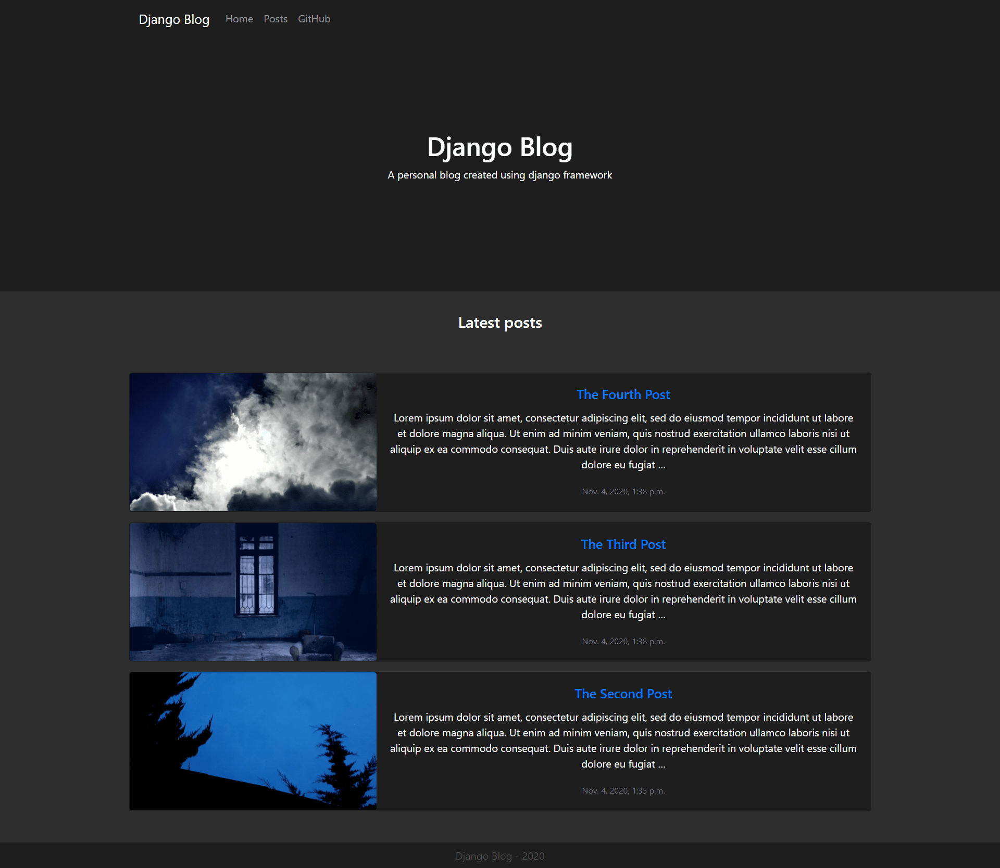

# Django-Blog

  

A personal blog (created using django framework)

# Getting Started

Visit [QUICKSTART.md](https://github.com/Sadra1f/Django-Blog/blob/main/QUICKSTART.md) for instructions on how to start the server.

Then you can use Django admin panel (default: `http://127.0.0.1:8000/admin/`) to add posts and approve comments.
